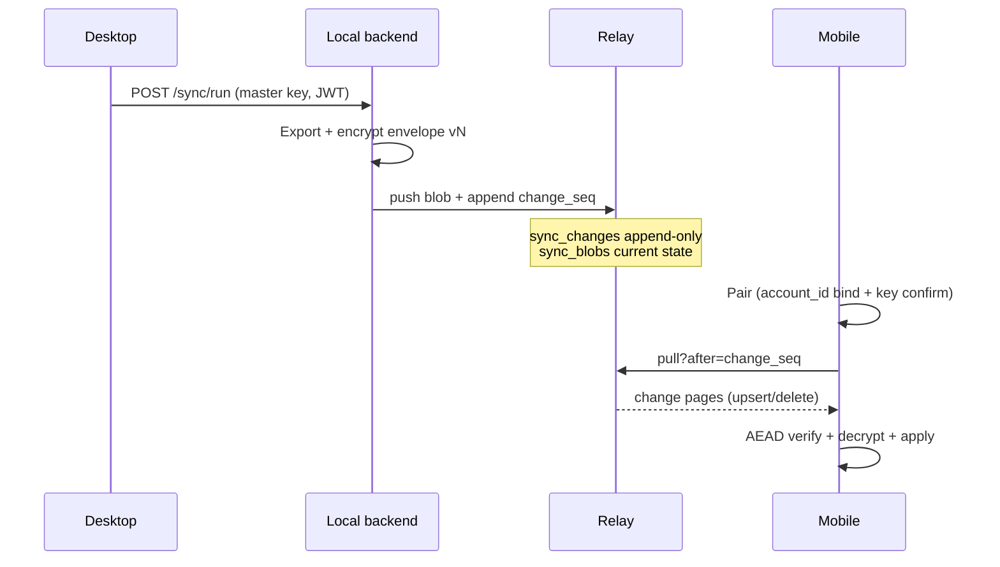

# GO SYNC hardening plan — close all known gaps

**Status:** GA residual slice landed (2026-07-26) — **code complete for §11 security/ops; E conflict inbox still deferred**  
**Owner:** Backend + Mobile + Security  
**Outcome:** Phone and desktop stay in sync with the *same* encrypted truth — pairing succeeds only when keys match the account; updates and deletes always deliver; crypto matches a single written contract.

### Implementation snapshot

| Area | Landed |
|------|--------|
| A change feed | `sync_changes` + `change_seq` pull; migration `023` |
| A10 retention | compact keep-N + `resync_required` / floor |
| B crypto v3 | AEAD AAD includes `account_id`; golden `sync/testdata/golden_envelopes.json` |
| C pairing | v2 grant + **key fingerprint** bind; mobile v1 rejected |
| D relay | allowlist = export set; schema 2–3; all-reject → 422 |
| G recovery | decrypt vs network; schema “Update EXO”; wipeDatabase on sign-out |
| S6 | `docs/runbooks/go-sync-revoke-rotate.md` |
| Deferred | E conflict inbox; cert pinning; structure cleanup H |

**North star (user):** Sign in → paste/scan once → memories and tasks appear and stay current. Never “linked” with empty/wrong data. Never logged out of sync because the protocol lied.

---

## 0. Verdict this plan answers

Current system = strong MVP scaffolding + recent triage, **not** senior-production sync. This plan closes every gap called out in the 2026-07 architecture audit (cursor, ADR drift, tombstones, pairing bind, schema, conflicts, tests, decomposition, desktop session).

---

## 1. In scope / out of scope

### In scope

| Area | Gap |
|------|-----|
| Relay delivery | Immutable row `id` as pull cursor + in-place upsert → updates invisible after first pull |
| Crypto contract | ADR-001 ≠ implementation (Argon2/XChaCha/wrapped keys vs deterministic ChaCha) |
| Envelope integrity | Unauthenticated `deleted` / metadata; tombstones applied without decrypt |
| Pairing | No account bind; `issued_at` ignored; wrong-size keys accepted until sync |
| Schema | ADR-003 not enforced; `digests` declared but not exported |
| Conflicts | ADR-002 `sync_conflicts` + user review missing (silent LWW) |
| Desktop key lifecycle | Keychain fail paths; Stay signed in; plaintext fallback when safeStorage missing |
| Mobile UX honesty | Decrypt vs network icons; pair-again after key mismatch; empty after wrong account |
| Contracts & tests | Golden vectors, update-after-cursor E2E, boundary validation |
| Structure | Fat orchestrators (`MobileSyncConfig`, syncWorker/IPC); shared typed envelope |

### Out of scope (defer with reason)

| Item | Why defer |
|------|-----------|
| CRDT / multi-writer merge | ADR-002 explicitly LWW + conflict inbox for v1 |
| Certificate pinning | Documented residual; separate mobile security epic |
| Push notifications for sync wake | Optional; not required for correctness |
| Password-derived master key UX | Only if we *choose* ADR-001 password model; see Phase B decision |
| Capture / outbound mobile push | Product-deferred; do not expand sync surface |
| Desktop ← mobile writeback | Pull-only mobile remains product rule |

---

## 2. Success criteria (ship bar)

- [x] **SC-1 Delivery:** Change feed + unit test (device smoke still required).
- [x] **SC-2 Tombstone:** AEAD-bound deletes; forged metadata fails decrypt (device smoke still required).
- [x] **SC-3 Pairing bind:** Grant + fingerprint + JWT account check.
- [x] **SC-4 Crypto one truth:** ADR-001 + `sync/testdata/golden_envelopes.json` in Py/Dart CI.
- [x] **SC-5 Schema:** “Update EXO…” + relay schema 2–3; all-reject → 422.
- [x] **SC-6 First sync honesty:** Decrypt vs network; Sign out on account mismatch; Sync-before-pair.
- [x] **SC-7 Session:** Fail-closed master key (device Keychain reopen still smoke).
- [ ] **SC-8 E2E gate:** Runbook ready — **human device pass** on staging after mig 023.

---

## 3. Architecture target (after plan)

**Canonical delivery model:**  
- `sync_blobs` = current ciphertext state per `(account, collection, record_id)`  
- `sync_changes` (new) = append-only log `(change_seq, account_id, collection, record_id, op, logical_clock, …)`  
- Pull cursor = `change_seq`, never blob row `id`

---

## 4. Phase plan (smallest shippable increments)

Execute in order. Do not start Phase C until A lands. Phase B decision gate before B2.

### Phase A — Delivery correctness (BLOCKER)

**Goal:** Updates and deletes are always pullable.

| ID | Work | Layer | Acceptance |
|----|------|-------|------------|
| A1 | Migration: `sync_changes` append-only table; backfill one change row per existing blob | cloud-node | Migration apply script + reverse note |
| A2 | `pushBlobs`: on accept newer LWW, upsert blob **and** insert change row with new `change_seq` | cloud-node | Unit: push twice → two change_seqs; pull after first cursor returns second |
| A3 | `pullBlobs`: `WHERE change_seq > ? ORDER BY change_seq`; return op + envelope fields | cloud-node | Cursor stability test |
| A4 | Mobile + desktop consumers use `change_seq` cursor (migrate stored cursor; reset if legacy blob-id cursor detected) | mobile, electron/backend prefs | Re-pair or one-shot cursor reset documented |
| A5 | Deprecate misuse of `sync_cursors.max(id)` as delivery truth (keep or repurpose as watermark only) | cloud-node | Docs + tests |

**Code-judo:** Do not “bump id” hacks on upsert — append log is the model.

**Exit:** SC-1 proven by test `push update after pull advances cursor → second pull receives update`.

---

### Phase B — Crypto & envelope integrity (BLOCKER)

**Decision gate B0 (half-day, Security + BE):** Choose one:

| Option | Pros | Cons |
|--------|------|------|
| **B0-a Keep implemented model** (random desktop master key, deterministic record keys, ChaCha20-Poly1305) | Already shipped; smaller change | Rewrite ADR-001; weaker vs password-derived story |
| **B0-b Implement ADR-001** (Argon2id, wrapped random record keys, XChaCha) | Matches accepted ADR | Large mobile+desktop rewrite; pairing UX changes |

**Recommendation:** **B0-a for GA**, rewrite ADR-001 to match code; schedule B0-b only if product requires password-portable keys.

| ID | Work | Layer | Acceptance |
|----|------|-------|------------|
| B1 | Rewrite or supersede ADR-001 to match chosen model; mark old text Superseded | docs | ADR accepted in PR |
| B2 | AEAD associated data (or encrypted mini-header) covering `collection`, `record_id`, `deleted`, `logical_clock`, `schema_version` | backend + mobile | Tampered tombstone rejected |
| B3 | Reject pairing `master_key_b64` unless decoded length == 32 | mobile (+ desktop emit) | Parse failure distinct copy |
| B4 | Golden vectors: Python encrypt ↔ Dart decrypt (and reverse) in CI | backend + mobile | `pytest` + `flutter test` share fixture file under `sync/testdata/` |
| B5 | Fail-closed desktop: no plaintext `sync_master_key.enc` in packaged builds; clear error if safeStorage unavailable | electron | Test + packaged check |

**Exit:** SC-2, SC-4.

---

### Phase C — Pairing trust & account bind

| ID | Work | Layer | Acceptance |
|----|------|-------|------------|
| C1 | Pairing payload includes `account_id` (or stable account hash) from desktop session | electron | Field present in QR/clipboard JSON (`v: 2` or additive v1) |
| C2 | Mobile rejects pair if signed-in account ≠ payload account | mobile | Distinct user copy (not decryptFailed) |
| C3 | Enforce `issued_at` freshness window (e.g. 15–30 min) | mobile | Expired → “Copy a fresh code” |
| C4 | Optional: desktop shows short pairing confirmation fingerprint (first/last 4 of key) | frontend | UX only; no secret logging |
| C5 | Version gate: support v1 during migration; prefer v2 with account bind | both | Old QR still works with warning or forced refresh |

**Exit:** SC-3, SC-6 (account mismatch path).

---

### Phase D — Schema, export parity, relay validation

| ID | Work | Layer | Acceptance |
|----|------|-------|------------|
| D1 | Enforce `sync/schemas/blob-envelope.json` on push (cloud-node) | cloud-node | Invalid → 422; test |
| D2 | Clients reject major `schema_version` with “Update app” | mobile (+ desktop consumer if any) | UI string + test |
| D3 | Export `digests` or remove from ADR-003 collection list | backend / docs | Parity with ADR |
| D4 | Cap ciphertext size / field lengths at relay | cloud-node | Oversized rejected |
| D5 | Collection allowlist at relay | cloud-node | Unknown collection rejected |

**Exit:** SC-5.

---

### Phase E — Conflicts (ADR-002)

| ID | Work | Layer | Acceptance |
|----|------|-------|------------|
| E1 | When LWW loser detected on desktop apply path, persist to local `sync_conflicts` | backend/electron | Row written |
| E2 | Settings → Sync: conflict inbox (list + keep mine / keep theirs) | frontend | UX slice |
| E3 | Mobile remains pull-only: no conflict UI required; apply relay winner only | mobile | Documented |

**Exit:** ADR-002 “loser revision stored for review” true on desktop. Can ship after A–D if GA pressure; not a delivery blocker.

---

### Phase F — Desktop session & sync ops honesty

| ID | Work | Layer | Acceptance |
|----|------|-------|------------|
| F1 | Surface Stay signed in default + quit-clear behavior in Account copy | frontend i18n | User understands logout-on-quit |
| F2 | Toggle Sync enable errors show Keychain-unreadable copy (already partial) | frontend | SC-7 |
| F3 | Desktop registers sync device on enable (parity with mobile) | electron + cloud-node | `sync_devices` row for desktop |
| F4 | `run_sync_push` typed errors (auth / entitlement / relay) not opaque catch-all | backend | Client status readable |
| F5 | Ensure Sync now before Copy pairing is nudged if never pushed | frontend | Reduces empty first sync |

---

### Phase G — Mobile product honesty & recovery

| ID | Work | Layer | Acceptance |
|----|------|-------|------------|
| G1 | First-sync / banners: decrypt kind ≠ network icon; Pair again → `clearPairing` | mobile | Done / verify in suite |
| G2 | Empty pull after successful decrypt → “Nothing from desktop yet” vs decrypt | mobile | Distinct empties |
| G3 | Sign-out wipe: assert DB file destroyed (`wipeDatabase`) in test | mobile | Security checklist |
| G4 | Register-device failure soft banner (non-blocking) | mobile | Already soft; keep |

---

### Phase H — Structure / maintainability (thermo-nuclear)

| ID | Work | Layer | Acceptance |
|----|------|-------|------------|
| H1 | Extract `SyncPairingService` / session vs pull orchestration from `MobileSyncConfig` | mobile | File &lt; 300 lines each |
| H2 | Extract electron pairing + master-key module from `syncWorker.js` | electron | Testable without full worker |
| H3 | Shared envelope TypeScript/JSON Schema package or `sync/schemas` as single contract | repo | BE + cloud-node import same schema |
| H4 | Kill duplicate pairing error mapping in setup vs settings | mobile | One helper |
| H5 | Do not grow `appHandlers.js` further for sync — new IPC in `electron/ipc/syncHandlers.js` | electron | Boundary |

---

### Phase I — Verification matrix (always-on with each phase)

| ID | Test | Phase |
|----|------|-------|
| I1 | Relay: update-after-cursor | A |
| I2 | Relay: delete-after-cursor | A |
| I3 | Golden crypto vectors Py↔Dart | B |
| I4 | Tampered tombstone rejected | B |
| I5 | Pairing account mismatch | C |
| I6 | Pairing expired `issued_at` | C |
| I7 | Schema 422 + client major reject | D |
| I8 | Desktop stay-signed-in quit/reopen (manual or spectron-level) | F |
| I9 | Update runbook `go-sync-e2e-smoke.md` + `mobile-pairing-smoke.md` | A–G |
| I10 | Security review pass on A+B+C | gate |

---

## 5. Suggested timeline (calendar, not estimates-as-commitment)

| Week | Focus | Ship |
|------|-------|------|
| 1 | A1–A5 + I1/I2 | Delivery fixed (internal) |
| 2 | B0 decision + B1–B5 | Crypto/ADR honesty + AEAD |
| 3 | C1–C5 + G1–G3 | Pairing trust + mobile recovery |
| 4 | D1–D5 + F1–F5 | Schema + desktop ops |
| 5 | E1–E3 (if capacity) + H1–H5 | Conflicts + cleanup |
| 6 | Full E2E + security review + PRODUCTION_READINESS tick | GA candidate |

Parallelize H only after A/B interfaces stabilize.

---

## 6. Risks

| Risk | Mitigation |
|------|------------|
| Cursor migration breaks existing phones | One-time cursor reset on pull protocol bump; force re-pull; version field in pull API |
| AEAD breaks old ciphertext | Dual-read period or require re-push from desktop after upgrade; bump `schema_version` |
| Pairing v2 breaks old QR | Accept v1 with warning; desktop always emits v2 |
| Scope creep into CRDT | Hard no — ADR-002 |
| Keychain still logs users out | F1–F2 + runbook; not solved by sync cursor alone |

---

## 7. Traceability — audit gap → plan ID

| Audit finding | Plan IDs |
|---------------|----------|
| Upsert + `id > cursor` hides updates | A1–A5 |
| ADR-001 ≠ code | B0, B1, B4 |
| Unauthenticated tombstones | B2 |
| Pairing no account bind / issued_at unused | C1–C3 |
| Schema / digests / validation | D1–D5 |
| Conflicts ADR unimplemented | E1–E3 |
| safeStorage plaintext / key regen | B5, F2 (regen already fail-closed) |
| Fat MobileSyncConfig / IPC | H1–H5 |
| Missing update-after-cursor test | I1 |
| No golden vectors | I3 / B4 |
| Account mismatch empty pull | C2, G2 |
| Decrypt shown as network | G1 |
| Desktop not registering device | F3 |
| Digests not exported | D3 |

---

## 8. Docs to update when phases land

- [ ] `docs/adr/001-sync-crypto.md` (B1)
- [ ] `docs/adr/002-sync-conflicts.md` status note when E ships
- [ ] `docs/adr/003-blob-schema.md` collections + enforcement
- [ ] New ADR: `00X-sync-change-feed.md` (A)
- [ ] `docs/SECURITY.md` GO SYNC section
- [ ] `docs/MOBILE_SECURITY_REVIEW.md` residual risks
- [ ] `docs/runbooks/go-sync-e2e-smoke.md`
- [ ] `docs/runbooks/mobile-pairing-smoke.md`
- [ ] `docs/PRODUCTION_READINESS.md` new PR-SYNC-* rows
- [ ] `docs/gtm/go-sync-checklist.md`

---

## 9. Minimum ship (GA cut line) — from PM review

**Ship for GA:** **A + B + C + G1–G3 + D** with tests **I1–I7, I9, I10** green.

**Defer past GA:** E (conflict inbox), F3–F5 (nice-to-have ops), H (structure cleanup — do not block correctness).

**Order adjustment:** Mobile recovery honesty (**G1–G3**) ships **with B/C**, not after.

**Legacy migration (required):** Document one actionable path for already-paired phones when feed/crypto bumps — full re-pull rebuild or “Pair again” — no silent half-state. Owner = Backend + Mobile.

---

## 10. /team review summary (2026-07-26)

| Role | Verdict |
|------|---------|
| PM | APPROVE WITH CHANGES — cut line + migration ownership |
| UX | APPROVE WITH CHANGES — exception copy + recovery contracts |
| Backend | APPROVE WITH CHANGES — immutable change snapshots + feed version |
| Cybersecurity | **REJECT** until §11 BLOCKs resolved |
| Reviewer | = Cybersecurity (auth/sync plan) |
| Tester | ⏭ plan-only |

---

## 11. Must-fix before execution / GA (BLOCK)

### Security (BLOCK)

| ID | Requirement |
|----|-------------|
| S1 | **Authenticated pairing grant** — not bare `account_id` in QR. Server-issued expiring, single-use (or short TTL) proof that the presented master key belongs to the signed-in account (encrypted challenge or signed grant). Plain account compare is insufficient against untrusted QR/relay. |
| S2 | **Complete B0-a crypto contract** if keeping current model: CSPRNG master key, HKDF/domain-separated record keys, unique nonce per key/revision, algo/version/key-id, AAD includes `account_id` (+ collection/record/deleted/clock/schema). ADR rewrite alone ≠ security. |
| S3 | **B2 + D1/D4/D5 gate A production rollout** — do not accept change-feed in prod while unauthenticated tombstones / unvalidated envelopes still land. |
| S4 | **Replay/rollback rules** — clients enforce authenticated monotonic `logical_clock` per record; document reordered/withheld/duplicated change behavior. |
| S5 | **No indefinite v1 pairing downgrade** — bounded migration window, then force fresh paired grant. |
| S6 | Device revoke / key rotate runbook (stolen phone / leaked QR). |

### Backend Phase A (must-fix in A design)

| ID | Requirement |
|----|-------------|
| A6 | Each `sync_changes` row stores **immutable accepted envelope snapshot** (not a live join to `sync_blobs`). |
| A7 | Push is **transactional**: LWW decide → upsert blob → append change; no append on stale/idempotent retry. |
| A8 | Deterministic LWW tie-break when `logical_clock` equal (not arrival-order). |
| A9 | Explicit **feed_version** / opaque cursor; reject legacy blob-id cursors; page apply atomic before cursor advance. |
| A10 | Retention/compaction + resync-floor response (unbounded log is not operable). |
| A11 | Schema/SQL parity: `content_hash` optional vs NOT NULL; collection allowlist vs `nudges`/`digests` export mismatch. |

### UX (must-fix copy contracts)

| Situation | User sees (intent) | Primary action |
|-----------|--------------------|----------------|
| Code expired | Pairing code expired | Get a new code (desktop Sync) |
| Wrong account | Code belongs to a different EXO account | Switch account / sign out — never Wi‑Fi |
| Decrypt fail | Phone can’t read this desktop’s data | Pair again (destructive: clears local synced cache) |
| Schema too old | Update EXO to continue syncing | Store/update route |
| Empty after good pull | Nothing from desktop yet | Sync on desktop / retry |
| Never pushed | Desktop must Sync once before pairing | Sync now → copy fresh code |

Rules: “Connected” only after validated pair + completed pull attempt; indeterminate sync status unless real counts; no jargon (cursor/AEAD/Keychain) in UI.

---

## 12. Revised immediate next actions

1. **Security + BE lock B0** and draft S1 pairing-grant design (blocks C as currently written).  
2. **Phase A design note** covering A6–A10 + feed_version ADR — then implement A1–A3 behind non-prod / dual-read if needed.  
3. Do **not** claim GA path until S1–S4 and A6–A9 are in the written plan + first PRs.  
4. UX: lock exception strings (§11 table) before C/G implementation.
